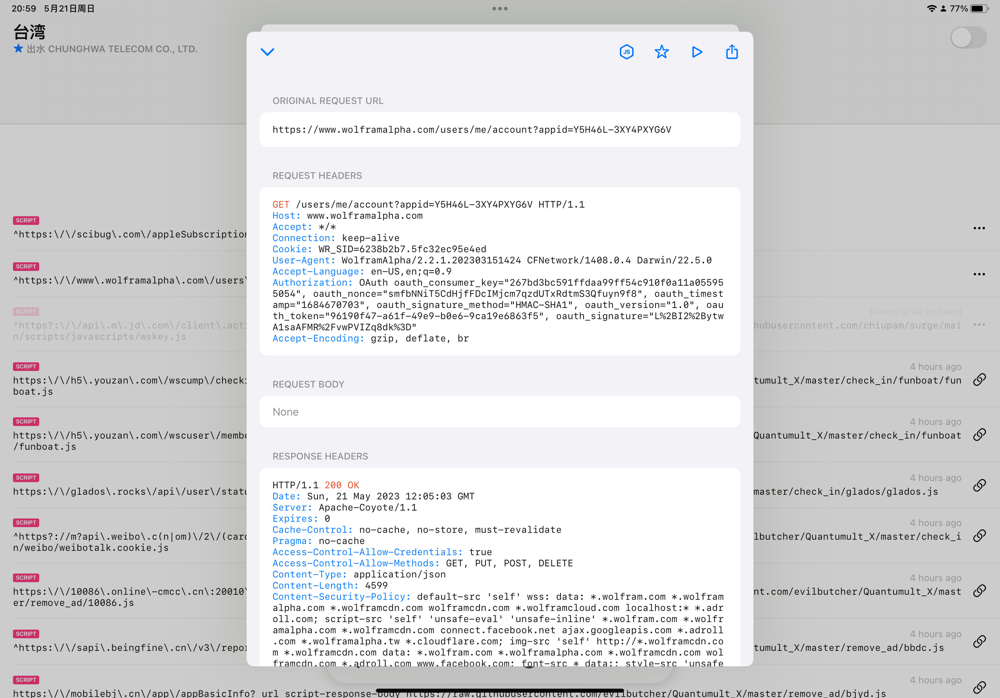

# 网络与信息安全大作业——移动APP安全方向

> 姓名：董若扬
>
> 教室：综教A102
>
> 学号：1120202944

## 一，实验目的

大三对于不少学生来说是备战考研的日子，丢下的数学又得捡起来学了。有一款久负盛名的计算软件Wolframalpha可以很好地帮助考研同学学习数学，它可以解决各种各样数学式子，最重要的是它能一步一步给出解题过程，以及提供更多例如答案验证以判断用户的答案可能是标准答案的等价形式，拍照输入以帮忙用户更便捷地使用等。


但是，订阅费用价值属实不便宜，70元一个月的服务费用，对于学生来说无疑是一笔巨大的开销。


那能不能让它变成一款“学习版”软件呢？

> 所谓学习版软件就是“本软件仅供学习交流，严禁用于商业用途，请于24小时内删除。”的软件。

## 二，实验过程

> Quantumult X是一款功能强大的iOS设备上的代理工具应用，它可以通过网络代理来实现用户的隐私保护和内容过滤等功能。Quantumult X支持多种代理协议，可以同时使用多个代理服务器，并支持自定义规则和过滤策略，用户可以根据自己的需求进行配置。此外，Quantumult X还支持重写和广告过滤等功能，可以有效提高用户的上网体验。

### 1.抓包

打开工具Quantumult X


打开HTTP抓取


打开wolframalpha一顿操作，然后切回Quantumult X查看抓包记录


### 2.查看抓包记录

锁定请求中带有account疑似与验证账号订阅有关的记录


请求

```http
https://www.wolframalpha.com/users/me/account?appid=YHPEJL-8G8W3UU8PG
```

请求头

```http
GET /users/me/account?appid=YHPEJL-8G8W3UU8PG HTTP/1.1
Host: www.wolframalpha.com
Accept: */*
Connection: keep-alive
Cookie: WR_SID=23fb200b.5fbfab0e15005
User-Agent: WolframAlpha/2.0.9.2021042758 CFNetwork/1408.0.4 Darwin/22.5.0
Accept-Language: zh-cn
Authorization: OAuth oauth_consumer_key="267bd3bc591ffdaa99ff54c910f0a11a055955054", oauth_nonce="4WSW9QfVQvgTig51ipOhBtzFiraOeLyzOv79GxVA", oauth_timestamp="1684429061", oauth_signature_method="HMAC-SHA1", oauth_version="1.0", oauth_token="aee2c040-ba20-4292-a41f-a1e22663b08b", oauth_signature="auQ2vE09opumGI1i%2Bb0JJoO6sI0%3D"
Accept-Encoding: gzip, deflate, br
```

响应头

```http
HTTP/1.1 200 OK
Date: Thu, 18 May 2023 16:57:46 GMT
Server: Apache-Coyote/1.1
Access-Control-Allow-Credentials: true
Access-Control-Allow-Methods: GET, PUT, POST, DELETE
Expires: 0
Cache-Control: no-cache, no-store, must-revalidate
Pragma: no-cache
Content-Type: application/json
Content-Length: 4599
Content-Security-Policy: default-src 'self' wss: data: *.wolfram.com *.wolframalpha.com *.wolframcdn.com wolframcdn.com *.wolframcloud.com localhost:* *.adroll.com; script-src 'self' 'unsafe-eval' 'unsafe-inline' *.wolfram.com *.wolframalpha.com *.wolframcdn.com connect.facebook.net ajax.googleapis.com *.adroll.com *.wolframalpha.tw *.cloudflare.com; img-src 'self' http://*.wolframcdn.com *.wolframcdn.com data: *.wolfram.com *.wolframalpha.com *.wolframcdn.com wolframcdn.com *.adroll.com www.facebook.com; font-src * data:; style-src 'unsafe-inline' 'self' data: *.wolfram.com *.wolframalpha.com *.wolframcdn.com wolframcdn.com fonts.googleapis.com;
Keep-Alive: timeout=2, max=100
Connection: Keep-Alive
```

响应体（JSON格式）

```json
{
    "account": {
        "status": {
            "proLevel": 1, // 专业等级
            "proForEducators": false, // 是否为教育用户
            "proForStudents": false, // 是否为学生用户
            "signedIn": true, // 是否已登录
            "hasError": false, // 是否有错误
            "error": null, // 错误信息
            "pro": false // 是否为专业用户
        },
        "error": null, // 错误信息
        "preferences": {
            "dateFormat": "Automatic", // 日期格式
            "location": "Automatic", // 地点
            "dataFormat": "Excel 97-2004", // 数据格式
            "contrast": 0, 
            "homepageShortcuts": false, // 是否显示主页快捷方式
            "resultsWidth": 4, // 结果宽度
            "country": "Automatic", // 国家
            "soundFormat": "mp3", // 声音格式
            "currency": "Automatic", //货币
            "updatedDate": 1680593659000, // 更新日期
            "homepageHints": 0, // 主页提示数量
            "imageFormat2d": "gif", // 2D图片格式
            "id": 7300242, // 用户ID
            "querySuggestion": false, // 是否显示查询建议
            "homepageFavorites": false, // 是否显示主页收藏夹
            "createdDate": 1680593659000, // 创建日期
            "hasError": false, // 是否有错误
            "error": null, // 错误信息
            "updatedBy": 0, // 更新者ID
            "timezone": "Automatic", // 时区
            "unitFormat": 0, // 单位格式
            "queryHistory": false, // 是否显示查询历史
            "keyboard": 0, // 键盘设置
            "imageFormat3d": "format 1", // 3D图片格式
            "fontSize": 0, // 字体大小
            "homepageBackground": "blue-circles", // 主页背景
            "homepageHistory": false, // 是否显示主页历史记录
            "homepageData": false, // 是否显示主页数据
            "userId": 11218653 // 用户ID
        },
        "profilingSet": null, 
        "subscriptions": {
            "billingDetails": null, // 计费详情
            "primarySubscription": { // 主要订阅
                "subscriptionId": 7816933, // 订阅ID
                "userUuid": "9e502ff5-ff7d-4dd1-bab8-7944972e9f16", 
                "planId": 1106, // 计划ID
                "finalAccessDate": null, // 最终访问日期
                "nda": false,
                "userId": 11218653, // 用户ID
                "paymentType": "CREDIT_CARD", // 付款类型
                "monthEnd": null, // 月末
                "nextBillingDate": null, // 下次计费日期
                "startDate": "2023-04-04", // 开始日期
                "plan": { // 计划详情
                    "planId": 1106, // 计划ID
                    "product": { // 产品详情
                        "productHost": "www.wolframalpha.com", // 产品域名
                        "productPricingUrl": "https://www.wolframalpha.com/pro", // 产品定价网址
                        "productReleased": false, // 产品已发布
                        "productId": 9, // 产品ID
                        "learnAboutUrl": "https://products.wolframalpha.com/", // 了解产品网址
                        "productReady": false, // 产品准备就绪
                        "contactUsUrl": "https://www.wolframalpha.com/contact.html", // 联系我们网址
                        "type": "SUBSCRIPTION", // 产品类型
                        "prettyName": "wa", 
                        "name": "Wolfram|Alpha", // 产品名称
                        "productUrl": "https://www.wolframalpha.com/" // 产品网址
                    },
                    "productId": 9, // 产品ID
                    "planType": "BASIC", // 计划类型
                    "description": "Wolfram Alpha Free Subscription", // 计划描述
                    "billingPeriod": "NONE", // 计费周期
                    "name": "Basic", // 计划名称
                    "canUpgrade": false // 是否可升级
                },
                "status": "ACTIVE", //订阅状态为活跃
                "monthStart": null // 月初
            },
            "nextPaidSubscription": null, // 下一个付费订阅
            "hasSubscriptions": true, // 是否有订阅
            "nextSubscription": null, // 下一个订阅
            "allSubscriptions": [ // 所有订阅
                {
                    "subscriptionId": 7816933, // 订阅ID
                    "userUuid": "9e502ff5-ff7d-4dd1-bab8-7944972e9f16",
                    "planId": 1106, // 计划ID
                    "finalAccessDate": null, // 最终访问日期
                    "nda": false,
                    "userId": 11218653, // 用户ID
                    "paymentType": "CREDIT_CARD", // 付款类型
                    "monthEnd": null, // 月末
                    "nextBillingDate": null, // 下次计费日期
                    "startDate": "2023-04-04", // 开始日期
                    "plan": { // 计划详情
                        "planId": 1106, // 计划ID
                        "product": { // 产品详情
                            "productHost": "www.wolframalpha.com", // 产品域名
                            "productPricingUrl": "https://www.wolframalpha.com/pro", // 产品定价网址
                            "productReleased": false, // 产品已发布
                            "productId": 9, // 产品ID
                            "learnAboutUrl": "https://products.wolframalpha.com/", // 了解产品网址
                            "productReady": false, // 产品准备就绪
                            "contactUsUrl": "https://www.wolframalpha.com/contact.html", // 联系我们网址
                            "type": "SUBSCRIPTION", // 产品类型
                            "prettyName": "wa",
                            "name": "Wolfram|Alpha", // 产品名称
                            "productUrl": "https://www.wolframalpha.com/" // 产品网址
                        },
                        "productId": 9, // 产品ID
                        "planType": "BASIC", // 计划类型
                        "description": "Wolfram Alpha Free Subscription", // 计划描述
                        "billingPeriod": "NONE", // 计费周期
                        "name": "Basic", // 计划名称
                        "canUpgrade": false // 是否可升级
                    },
                    "status": "ACTIVE", //订阅状态为活跃
                    "monthStart": null // 月初
                },
                {
                    "subscriptionId": 7816934, // 订阅ID
                    "userUuid": "9e502ff5-ff7d-4dd1-bab8-7944972e9f16", 
                    "planId": 1106, // 计划ID
                    "finalAccessDate": null, // 最终访问日期
                    "nda": false, 
                    "userId": 11218653, // 用户ID
                    "paymentType": "CREDIT_CARD", // 付款类型
                    "monthEnd": null, // 月末
                    "nextBillingDate": null, // 下次计费日期
                    "startDate": "2023-04-04", // 开始日期
                    "plan": { // 计划详情
                        "planId": 1106, // 计划ID
                        "product": { // 产品详情
                            "productHost": "www.wolframalpha.com", // 产品域名
                            "productPricingUrl": "https://www.wolframalpha.com/pro", // 产品定价网址
                            "productReleased": false, // 产品已发布
                            "productId": 9, // 产品ID
                            "learnAboutUrl": "https://products.wolframalpha.com/", // 了解产品网址
                            "productReady": false, // 产品准备就绪
                            "contactUsUrl": "https://www.wolframalpha.com/contact.html", // 联系我们网址
                            "type": "SUBSCRIPTION", // 产品类型
                            "prettyName": "wa",
                            "name": "Wolfram|Alpha", // 产品名称
                            "productUrl": "https://www.wolframalpha.com/" // 产品网址
                        },
                        "productId": 9, // 产品ID
                        "planType": "BASIC", // 计划类型
                        "description": "Wolfram Alpha Free Subscription", // 计划描述
                        "billingPeriod": "NONE", // 计费周期
                        "name": "Basic", // 计划名称
                        "canUpgrade": false // 是否可升级
                    },
                    "status": "ACTIVE", //订阅状态为活跃
                    "monthStart": null // 月初
                }
            ],
            "hasError": false, // 是否有错误
            "error": null // 错误信息
        },
        "links": {
            "facebook": null // Facebook链接
        },
        "persona": null,
        "permissions": {
            "error": null, // 没有错误信息
            "hasError": false, // 没有错误
            "features": {
                "cdfDownload": {
                    "units": null, 
                    "value": false // 不允许CDF下载
                },
                "zoomSubpods": {
                    "units": null, 
                    "value": false // 不允许缩放subpods
                },
                "webApps": {
                    "units": null,
                    "value": "" // 空字符串
                },
                "pdfDownload": {
                    "units": null,
                    "value": false // 不允许PDF下载
                },
                "imageInput": {
                    "units": "MB", // 单位为MB
                    "value": 0 // 图片输入为0
                },
                "showSteps": {
                    "units": null,
                    "value": false // 不显示步骤
                },
                "cdfInteractivePods": {
                    "units": null,
                    "value": false // 不允许交互式CDF
                },
                "dataInput": {
                    "units": null,
                    "value": false // 不允许输入数据
                },
                "emailProductSupport": {
                    "units": null, 
                    "value": false // 不允许通过电子邮件联系产品支持
                },
                "longerTimeouts": {
                    "units": "seconds", 
                    "value": 0 // 超时时间为0
                },
                "storeDownloadedData": {
                    "units": null,
                    "value": false // 不储存下载的数据
                },
                "specialCharacterKeyboards": {
                    "units": null,
                    "value": false // 不允许使用特殊字符键盘
                },
                "removeAds": {
                    "units": null,
                    "value": false // 不移除广告
                },
                "practiceSheets": {
                    "units": null,
                    "value": false // 不提供练习题
                },
                "copyablePlaintext": {
                    "units": null,
                    "value": false // 不允许复制纯文本
                },
                "downloadPodData": {
                    "units": null,
                    "value": false // 不允许下载pod数据
                },
                "customizeGraphicsPods": {
                    "units": null,
                    "value": false // 不允许自定义图形pod
                },
                "fileUpload": {
                    "units": "MB", // 单位为MB
                    "value": 0 // 文件上传大小为0
                },
                "saveSubpodAsImage": {
                    "units": null, 
                    "value": false // 不允许将subpod保存为图片
                },
                "embeddablePods": {
                    "units": null, 
                    "value": false // 不允许嵌入式pod
                }
            }
        },
        "hasError": false, // 没有错误
        "info": {
            "email": "1729361922@qq.com", // 邮箱
            "name": "dg ry", // 名字
            "hasError": false, // 没有错误
            "error": null // 没有错误信息
        }
    },
    "profilingSet": null,
    "hasError": false, // 没有错误
    "error": null // 没有错误信息
}
```

### 3.修改响应体

#### (1)修改用户状态信息

把订阅等级设置为最高3，把教育用户资格和学生用户资格权限都改为true，最后再打开“pro”权限。

```json
        "status": {
            "proLevel": 3,
            "proForEducators": true,
            "proForStudents": true,
            "signedIn": true,
            "hasError": false,
            "error": null,
            "pro": true
        }
```

#### （2）修改订阅生效时期

```json
                "finalAccessDate": "2099-12-31",
                "monthEnd": "2099-12-31",
                "nextBillingDate": "2099-12-31",
```

#### （3）修改订阅服务等级

```json
                    "planId": 1109,
                    "productId": 12,
                    "planType": "PRO",
                    "description": "Wolfram Alpha Professional Subscription",
                    "name": "Professional",

```

#### （4）修改服务权限

##### 提供可计算文档格式下载

> CDF的全称为Computable Document Format，即可计算文档格式。是一种交互式文档格式，由Wolfram Research公司开发。CDF文件可以包含文本、数学、图表、动画、交互式控件等多种元素，用户可以与这些元素进行交互，包括输入数据、调整参数、执行计算等操作。

```json
"cdfDownload": {
    "units": null,
    "value": true
},
```

##### 缩放subpods

> 在WolframAlpha中，subpod是指一个小的独立元素，通常用于呈现给定查询结果中的特定信息。在查询结果中，一个或多个subpod可以组成一个pod。每个subpod通常包含一个标题和一个或多个表示相关信息的文本、图像、表格或其他类型的内容。subpod的作用是帮助用户更好地理解查询结果，提供更详细的信息。通过组合和排列subpod，WolframAlpha可以为用户呈现非常复杂和详细的结果。

```json
"zoomSubpods": {
    "units": null,
    "value": true
},
```

##### 提供PDF下载

> WolframAlpha订阅服务中的PDF下载功能可以将查询结果以PDF文档的形式保存下来，方便离线查看，方便打印，方便分享，方便存档。

```json
"pdfDownload": {
    "units": null,
    "value": true
},
```

##### 显示步骤

> WolframAlpha订阅服务中的"Step-by-step solution"功能可以将问题的解决过程以逐步展示的形式呈现出来。该功能便于学习和理解，验证和检查，教学和演示。

```json
"showSteps": {
    "units": null,
    "value": true
},
```

##### 提供交互式可计算文档格式

> WolframAlpha订阅服务中的交互式可计算文档格式是一种基于Wolfram技术的文档格式，可以包含计算、图表、动画、交互式控件等元素，并且可以与Wolfram计算引擎进行交互，这个功能便于制作教学材料，制作报告和演示，进行数据分析和建模，进行科学计算和编程。

```json
"cdfInteractivePods": {
    "units": null,
    "value": true
},
```

##### 提供产品服务支持

> WolframAlpha仅向订阅服务的用户提供支持，如果只享受订阅服务没有相应的服务支持，那么就没有获得该软件完整的订阅服务。

```json
"emailProductSupport": {
    "units": null,
    "value": true
},
```

##### 允许数据存入本地文件

> 允许用户将查询结果中的数据保存到本地文件中，便于数据备份和存档，数据共享和交流，数据分析和可视化。

```json
"storeDownloadedData": {
    "units": null,
    "value": true
},
```

##### 提供特殊字符键盘

> WolframAlpha订阅服务中提供特殊字符键盘可以帮助用户更方便地输入和编辑特殊字符和符号，例如数学符号和公式，物理符号和公式。

```json
"specialCharacterKeyboards": {
    "units": null,
    "value": true
},
```

##### 移除广告

> 字面意思，可以帮助用户更好地专注于查询结果和使用体验，而不被广告打扰。

```json
"removeAds": {
    "units": null,
    "value": true
},
```

##### 提供习题

> WolframAlpha订阅服务中提供习题功能可以帮助用户学习和练习各种数学、物理、化学和工程等领域的习题，以提高其学习和应用能力。

```json
"practiceSheets": {
    "units": null,
    "value": true
},
```

##### 允许复制纯文本

> 可以帮助用户将查询结果中的文本信息复制到剪贴板中，以便在其他应用程序中进行编辑和使用

```json
"copyablePlaintext": {
    "units": null,
    "value": true
},
```

##### 提供pod数据下载

> 可以帮助用户将查询结果中的图像、表格、图表等数据保存到本地文件中。

```json
"downloadPodData": {
    "units": null,
    "value": true
},
```

##### 允许自定义图形pod

> 可以帮助用户自定义查询结果中的图形信息，以满足其特定的需求和要求。自定义查询结果中的图形信息可以帮助用户将其美化和定制。用户可以调整图形的颜色、样式、字体、标签等等，以获得更美观、更专业的图形。自定义查询结果中的图形信息可以帮助用户更好地进行图形分析和比较。用户可以添加、删除、调整图形元素，以获得更准确、更全面的图形分析结果。自定义查询结果中的图形信息可以帮助用户更方便地导出和共享图形。

```json
"customizeGraphicsPods": {
    "units": null,
    "value": true
},
```

##### 允许subpod另存为图片

> 可以帮助用户将查询结果中的子图像信息保存为图片文件。保存查询结果中的子图像信息可以帮助用户备份和存档图像，以备将来需要时使用。保存查询结果中的子图像信息可以帮助用户更方便地进行图像编辑和处理。用户可以使用其他图像处理软件来编辑和处理图像文件，以获得更好的效果。

```json
"saveSubpodAsImage": {
    "units": null,
    "
```

##### 提供嵌入式pod

> 可以帮助用户将查询结果中的图像、表格、图表等信息嵌入到其网站或博客中，以便在网站或博客中展示和共享查询结果。

```json
"embeddablePods": {
    "units": null,
    "value": true
}
```

### 4.编写js实现以上更改

```js
var body = $response.body;
// 解析响应体为 JSON 对象
let obj;
try {
    obj = JSON.parse(body);
} catch (error) {
    console.error(`Failed to parse JSON: ${error}`);
    $done();
}

const newAccountStatus = {
    proLevel: 3,
    proForEducators: true,
    proForStudents: true,
    pro: true,
};

const newPrimarySubscriptionPlan = {
    ...obj.account.subscriptions.primarySubscription.plan,
    planId: 1109,
    product: {
        ...obj.account.subscriptions.primarySubscription.plan.product,
        productId: 12,
    },
    productId: 12,
    planType: "PRO",
    description: "Wolfram Alpha Professional Subscription",
    name: "Professional",
};

const newSubscription = {
    finalAccessDate: "2099-12-31",
    monthEnd: "2099-12-31",
    nextBillingDate: "2099-12-31",
    plan: newPrimarySubscriptionPlan,
};

const newAllSubscription = {
    ...newSubscription,
    plan: {
        ...newPrimarySubscriptionPlan,
        name: "Pro",
    },
};

const newPermissions = {
    cdfDownload: {
        units: null,
        value: true,
    },
    zoomSubpods: {
        units: null,
        value: true,
    },
    pdfDownload: {
        units: null,
        value: true,
    },
    showSteps: {
        units: null,
        value: true,
    },
    cdfInteractivePods: {
        units: null,
        value: true,
    },
    dataInput: {
        units: null,
        value: true,
    },
    emailProductSupport: {
        units: null,
        value: true,
    },
    storeDownloadedData: {
        units: null,
        value: true,
    },
    specialCharacterKeyboards: {
        units: null,
        value: true,
    },
    removeAds: {
        units: null,
        value: true,
    },
    practiceSheets: {
        units: null,
        value: true,
    },
    copyablePlaintext: {
        units: null,
        value: true,
    },
    downloadPodData: {
        units: null,
        value: true,
    },
    customizeGraphicsPods: {
        units: null,
        value: true,
    },
    saveSubpodAsImage: {
        units: null,
        value: true,
    },
    embeddablePods: {
        units: null,
        value: true,
    },
};

const newAccountInfo = {
    email: "1120202944@bit.edu.cn",
    name: "网络与信息安全大作业",
};

// 修改账户状态和订阅信息
try {
    obj.account.status = {...obj.account.status, ...newAccountStatus};

    obj.account.subscriptions.primarySubscription.plan =
        newPrimarySubscriptionPlan;
    obj.account.subscriptions.primarySubscription = {
        ...obj.account.subscriptions.primarySubscription,
        ...newSubscription,
    };

    obj.account.subscriptions.allSubscriptions[0].plan =
        newPrimarySubscriptionPlan;
    obj.account.subscriptions.allSubscriptions[0] = {
        ...obj.account.subscriptions.allSubscriptions[0],
        ...newAllSubscription,
    };

    obj.account.permissions.features = {
        ...obj.account.permissions.features,
        ...newPermissions,
    };

    obj.account.info = {...obj.account.info, ...newAccountInfo};

    body = JSON.stringify(obj);
    $done(body);
} catch (error) {
    console.error(`Failed to modify JSON object: ${error}`);
}
```

js保存在Quantumult X文件夹下的Scripts文件夹中


### 5.添加Rewrite规则

> Quantumult X中的Rewrite Rule（重写规则）是一种功能强大的网络代理工具，它可以对网络请求进行修改和重定向，从而实现一些特定的目的。具体来说，Rewrite Rule可以实现以下几种功能：
>
> 1. 修改请求参数：Rewrite Rule可以修改HTTP请求中的参数，例如将URL中的参数修改为指定的值，或者删除某些参数。
>
> 2. 重定向请求：Rewrite Rule可以将某些请求重定向到指定的URL，从而实现对特定网站或应用程序的访问控制。
>
> 3. 修改响应内容：Rewrite Rule可以修改HTTP响应中的内容，例如将响应中的某些内容替换为指定的值，或者删除响应中的某些内容。
>
> 通过使用Rewrite Rule，用户可以实现对网络请求的精细控制，从而提高网络代理的效果和安全性。例如，可以使用Rewrite Rule来阻止某些恶意网站的访问，或者将某些网站的广告屏蔽掉，提高用户的上网体验。


### 6.在MitM中添加主机名

> Quantumult X中的MitM（Man-in-the-Middle）是一种网络代理的功能，它可以在用户与目标网站之间建立一个加密的中间层，从而实现对网络请求和响应的拦截和修改。具体来说，Quantumult X中的MitM可以实现以下几种功能：
>
> 1. SSL/TLS解密：Quantumult X中的MitM可以解密HTTPS请求和响应中的SSL/TLS加密数据，从而实现对加密流量的拦截和修改。
>
> 2. 请求和响应修改：Quantumult X中的MitM可以修改HTTP请求和响应中的内容，例如添加、删除、修改请求头或响应头，以及修改响应体中的内容等。
>
> 3. 认证拦截：Quantumult X中的MitM可以拦截和修改需要认证的网络请求，例如修改账号、密码等信息，从而实现对认证的绕过和破解。
>
> 通过使用MitM，用户可以实现对网络请求和响应的精细控制和拦截，从而提高网络代理的效果和安全性。例如，可以使用MitM来拦截和修改恶意软件的网络请求，或者拦截和修改某些应用程序的网络请求，从而实现对特定应用程序的访问控制和过滤。


### 7.生成和安装CA证书


## 三，实验结果

### 1.账户详情

实验前：


实验后：


### 2.拍照输入

实验前：


实验后：


### 3.步骤详解

实验前：


实验后：


------

找来找去都没找到其他会员功能了，正觉得奇怪，为什么响应体中这么多字段，上App Store一看，发现有两款Wolframalpha。

本次实验使用的是Classic版本，功能较少，于是下载了完整版再抓了一次包。



经比对，响应体完全一致，那么前面的工作就能继续用于这一款App了。

### 4.Wolframalpha主界面

实验前：


实验后：


接下来在wolframalpha中测试剩余的功能

### 5.图像分析

实验前：


实验后：


### 6.Assistants

> 在 Wolfram Alpha 中，Course Assistants, Personal Assistants, Professional Assistants 和 Reference Assistants是基于 Wolfram Alpha 引擎的应用程序，它们提供不同的功能和服务。
>
> 1. Course Assistants：提供了一系列的辅助教学工具，可以帮助学生在数学、物理、化学等领域进行学习和作业。
> 2. Personal Assistants：提供了一系列的个人助手工具，可以帮助用户解决各种问题，如计算机科学、工程学、统计学、金融学、音乐等。
> 3. Professional Assistants：提供了一系列的专业助手工具，可以帮助专业人士进行研究和开发工作，如化学、材料科学、天文学、地理信息系统等。
> 4. Reference Assistants：提供了一系列的参考工具，可以帮助用户查找和了解各种知识，如生物学、医学、法律、历史等。

实验前：


实验后：


由于该软件功能范围很广，涵盖文科，理科，工科方方面面，做完全的功能测试得照着使用手册做才行，本人仅对首页展示的以及订阅服务中宣传的功能进行了测试，验证均可正常使用。

实验过程中发现另一款相似的App——symbolab，在App Store上打广告，所以也下载下来看看实力如何。

测试了一下发现在step-by-step solution上功能与wolframalpha基本一致，但是输入界面比较贴近卡西欧计算器风格，且有中文，可以作为一款wolframalpha的平替产品。但是解锁完整服务一样很贵。


接着就照葫芦画瓢，不赘述实验过程了。以下是实验截图：


## 四，有待完善的地方

Quantumult X可以构造HTTP或HTTPS请求，在特定时间发送，自动化完成一些js脚本，例如我以百度贴吧自动签到脚本为学习示例：


尝试写一个wolframalpha的自动化脚本，用于获取圆周率的值。

```javascript
const url = "http://api.wolframalpha.com/v1/result";
const method = "GET";
const appid = "";
const query = "pi"; 
const params = {appid: appid, i: query};

const myRequest = {
    url: url,
    method: method, 
    body: params 
};

$task.fetch(myRequest).then(response => {
    console.log(response.body);
    $notify("Title", "Subtitle", response.body); 
    $done();
}, reason => {
    $notify("Title", "Subtitle", reason.error);
    $done();
});
```

但是，申请不到Wolfram|Alpha API


再加上脚本内容是定死的，自动化运行对于wolframalpha来说意义不大，所以就没在这个方向上再深入了，不过也学到了一些js的知识。

后来我发现Apple自带的Shortcuts很适合这种提供接口的服务，例如这种用户可以自行输入想要求解的算式，但是Shortcuts有点像模块化编程，又是另一块知识领域了。


以及chatgpt能将其他数学表达格式转换为wolframalpha的算术表达式，可以很方便的把一些矩阵等复杂的“块”用wolframalpha的“自然语言”表达出来。相关内容在b站看过教程，但是需要额外学习的内容很多，留给将来其他项目需要用到此块内容时继续完善。
